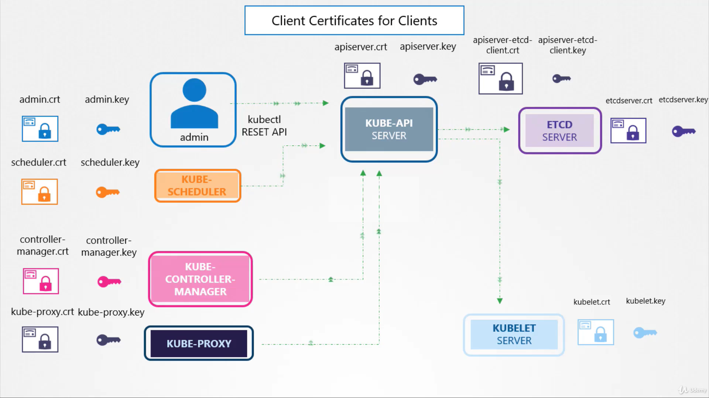
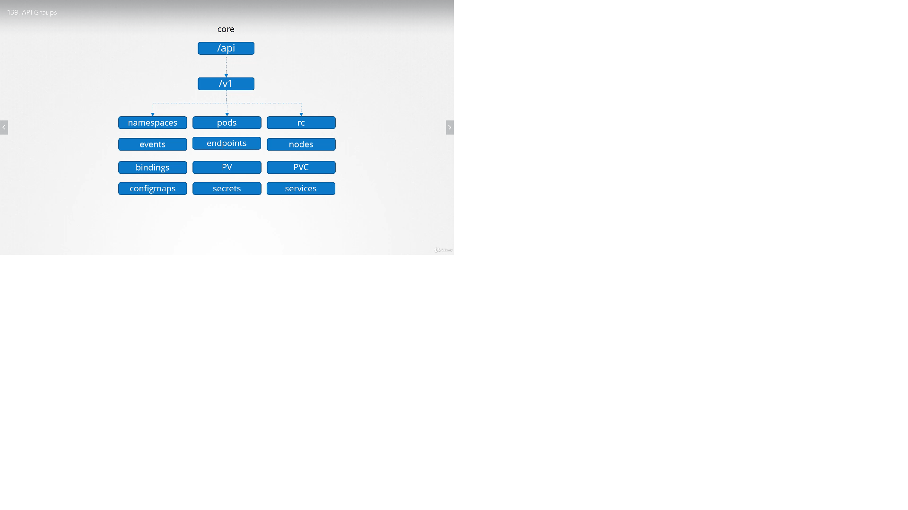
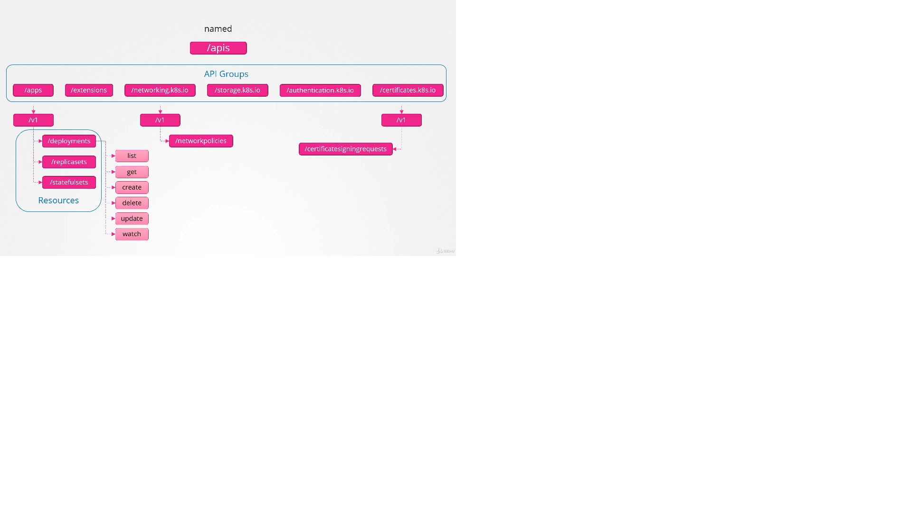
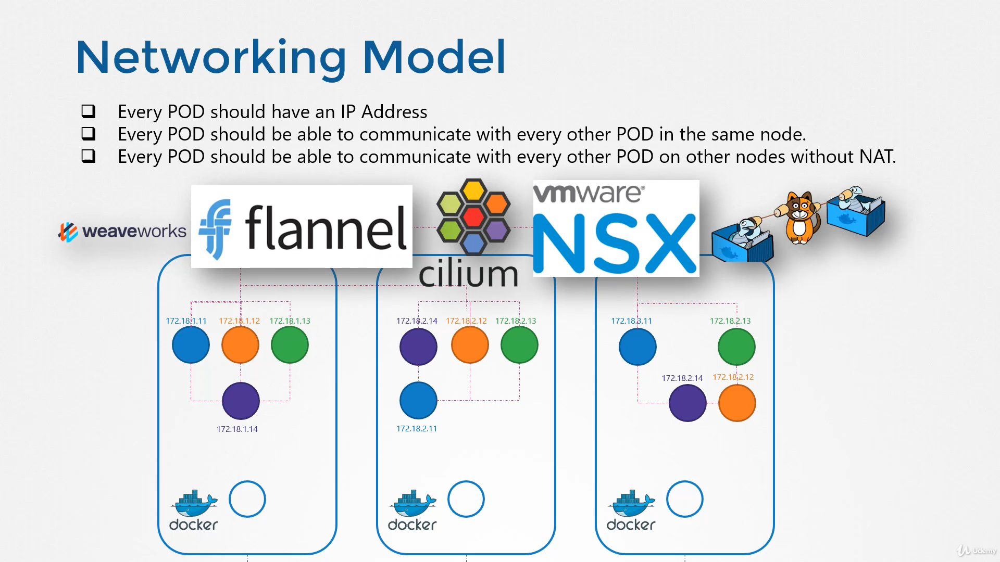

# Kubernetes Core Concepts
Kubernetes (K8s) is an open-source system for automating deployment, scaling, and management of containerized applications.
## Kubernetes Cluster Archticture
      it mainly consist of 
            1) master node:
                  masternode consists of : 
                        #1 Kubeapi Server
                        #2 ETCD
                        #3 Controller Manager
                        #4 Kube Scheduler
            2) worker node
                        #1 kublet
                        #2 kube proxy
## 1 ETCD:
* Etcd is a consistent and highly-available key value store used as Kubernetes’ backing store for all cluster data
* ETCD Stores information for nodes,pods,config,secret,accoutns,roles,bindings & others, every command u run through kubctl & every node added will be updated in etcd server
* ETCD use port 2379


### Multi-node etcd cluste
update the following in etcd.yaml file 
```
--listen-client-urls=http://$IP1:2379, http://$IP2:2379, http://$IP3:2379, http://$IP4:2379, http://$IP5:2379 --advertise-client-urls=http://$IP1:2379, http://$IP2:2379, http://$IP3:2379, http://$IP4:2379, http://$IP5:2379

Start Kubernetes API servers with the flag --etcd-servers=$IP1:2379, $IP2:2379, $IP3:2379, $IP4:2379, $IP5:2379
```

### ETCD POD
```
apiVersion: v1
kind: Pod
metadata:
  creationTimestamp: null
  labels:
    component: etcd
    tier: control-plane
  name: etcd
  namespace: kube-system
spec:
  containers:
  - command:
    - etcd
    - --advertise-client-urls=https://10.200.20.247:2379
    - --cert-file=/etc/kubernetes/pki/etcd/server.crt
    - --client-cert-auth=true
    - --data-dir=/var/lib/etcd
    - --initial-advertise-peer-urls=https://10.200.20.247:2380
    - --initial-cluster=kubemaster=https://10.200.20.247:2380
    - --key-file=/etc/kubernetes/pki/etcd/server.key
    - --listen-client-urls=https://127.0.0.1:2379,https://10.200.20.247:2379
    - --listen-peer-urls=https://10.200.20.247:2380
    - --name=kubemaster
    - --peer-cert-file=/etc/kubernetes/pki/etcd/peer.crt
    - --peer-client-cert-auth=true
    - --peer-key-file=/etc/kubernetes/pki/etcd/peer.key
    - --peer-trusted-ca-file=/etc/kubernetes/pki/etcd/ca.crt
    - --snapshot-count=10000
    - --trusted-ca-file=/etc/kubernetes/pki/etcd/ca.crt
    image: k8s.gcr.io/etcd:3.3.10
    imagePullPolicy: IfNotPresent
    livenessProbe:
      exec:
        command:
        - /bin/sh
        - -ec
        - ETCDCTL_API=3 etcdctl --endpoints=https://[127.0.0.1]:2379 --cacert=/etc/kubernetes/pki/etcd/ca.crt
          --cert=/etc/kubernetes/pki/etcd/healthcheck-client.crt --key=/etc/kubernetes/pki/etcd/healthcheck-client.key
          get foo
      failureThreshold: 8
      initialDelaySeconds: 15
      timeoutSeconds: 15
    name: etcd
    resources: {}
    volumeMounts:
    - mountPath: /var/lib/etcd
      name: etcd-data
    - mountPath: /etc/kubernetes/pki/etcd
      name: etcd-certs
  hostNetwork: true
  priorityClassName: system-cluster-critical
  volumes:
  - hostPath:
      path: /etc/kubernetes/pki/etcd
      type: DirectoryOrCreate
    name: etcd-certs
  - hostPath:
      path: /var/lib/etcd
      type: DirectoryOrCreate
    name: etcd-data
status: {}

```
## KubeApi Server: 
* The Kubernetes API server validates and configures data for the api objects which include pods, services, replicationcontrollers, and others. The API Server services REST operations and provides the frontend to the cluster’s shared state through which all other components interact.
* kube api server performs following functions,
```
      * Authenticate user
      * validate request
      * retrive data
      * update etcd
      * scheduler
      * kubelet
 ```
* first it authentecate & validate user and retrives data from etcd and response back requested info, now schedluer contiounsly moniter the api server and identifys that no nodes is assigend for pod and then assigns node and communicate back to api server ,then api server updates back to etcd server, then api server sends to kubelet , then kubelet create appropriate pod in node and sends status to api server, then api server updates in etcd 
* kube api server file is located in /etc/kubernetes/manifests/kube-apiserver.yaml
* kube api services for nod kubeadmin setup  /etc/systemd/system/kube-apiserver.service
* ps -aux |grep kube-apiserver 

```
kind: Pod
metadata:
  creationTimestamp: null
  labels:
    component: kube-apiserver
    tier: control-plane
  name: kube-apiserver
  namespace: kube-system
spec:
  containers:
  - command:
    - kube-apiserver
    - --advertise-address=10.200.20.247
    - --allow-privileged=true
    - --authorization-mode=Node,RBAC
    - --client-ca-file=/etc/kubernetes/pki/ca.crt
    - --enable-admission-plugins=NodeRestriction
    - --enable-bootstrap-token-auth=true
    - --etcd-cafile=/etc/kubernetes/pki/etcd/ca.crt
    - --etcd-certfile=/etc/kubernetes/pki/apiserver-etcd-client.crt
    - --etcd-keyfile=/etc/kubernetes/pki/apiserver-etcd-client.key
    - --etcd-servers=https://127.0.0.1:2379
    - --insecure-port=0
    - --kubelet-client-certificate=/etc/kubernetes/pki/apiserver-kubelet-client.crt
    - --kubelet-client-key=/etc/kubernetes/pki/apiserver-kubelet-client.key
    - --kubelet-preferred-address-types=InternalIP,ExternalIP,Hostname
    - --proxy-client-cert-file=/etc/kubernetes/pki/front-proxy-client.crt
    - --proxy-client-key-file=/etc/kubernetes/pki/front-proxy-client.key
    - --requestheader-allowed-names=front-proxy-client
    - --requestheader-client-ca-file=/etc/kubernetes/pki/front-proxy-ca.crt
    - --requestheader-extra-headers-prefix=X-Remote-Extra-
    - --requestheader-group-headers=X-Remote-Group
    - --requestheader-username-headers=X-Remote-User
    - --secure-port=6443
    - --service-account-key-file=/etc/kubernetes/pki/sa.pub
    - --service-cluster-ip-range=10.96.0.0/12
    - --tls-cert-file=/etc/kubernetes/pki/apiserver.crt
    - --tls-private-key-file=/etc/kubernetes/pki/apiserver.key
    image: k8s.gcr.io/kube-apiserver:v1.15.12
    imagePullPolicy: IfNotPresent
    livenessProbe:
      failureThreshold: 8
      httpGet:
        host: 10.200.20.247
        path: /healthz
        port: 6443
        scheme: HTTPS
      initialDelaySeconds: 15
      timeoutSeconds: 15
    name: kube-apiserver
    resources:
      requests:
        cpu: 250m
    volumeMounts:
    - mountPath: /etc/ssl/certs
      name: ca-certs
      readOnly: true
    - mountPath: /etc/pki
      name: etc-pki
      readOnly: true
    - mountPath: /etc/kubernetes/pki
      name: k8s-certs
      readOnly: true
  hostNetwork: true
  priorityClassName: system-cluster-critical
  volumes:
  - hostPath:
      path: /etc/ssl/certs
      type: DirectoryOrCreate
    name: ca-certs
  - hostPath:
      path: /etc/pki
      type: DirectoryOrCreate
    name: etc-pki
  - hostPath:
      path: /etc/kubernetes/pki
      type: DirectoryOrCreate
    name: k8s-certs
status: {}

```
## Kube Controller Manager:
*   The Kubernetes controller manager is a daemon that embeds the core control loops shipped with Kubernetes. In applications of robotics and automation, a control loop is a non-terminating loop that regulates the state of the system. In Kubernetes, a controller is a control loop that watches the shared state of the cluster through the apiserver and makes changes attempting to move the current state towards the desired state. Examples of controllers that ship with Kubernetes today are the replication controller, endpoints controller, namespace controller, and serviceaccounts controller
* kube controller manages nodes and pods , it moniters nodes and pods if anything it act accordingly 
* it consist of node controller ,replication controller, deployment controller,namespace controller, replicaset,pv controller ,endpoint controller,job controller, service account controller.
      ** node controller moniter nodes for every 5s
      ** it gives 40s to come back (grace period )
 * kube controller server file is located in /etc/kubernetes/manifests/kube-controller-manager.yaml
* kube api services for nod kubeadmin setup  /etc/systemd/system/kube-controller-manager.service 

```
apiVersion: v1
kind: Pod
metadata:
  creationTimestamp: null
  labels:
    component: kube-controller-manager
    tier: control-plane
  name: kube-controller-manager
  namespace: kube-system
spec:
  containers:
  - command:
    - kube-controller-manager
    - --authentication-kubeconfig=/etc/kubernetes/controller-manager.conf
    - --authorization-kubeconfig=/etc/kubernetes/controller-manager.conf
    - --bind-address=127.0.0.1
    - --client-ca-file=/etc/kubernetes/pki/ca.crt
    - --cluster-signing-cert-file=/etc/kubernetes/pki/ca.crt
    - --cluster-signing-key-file=/etc/kubernetes/pki/ca.key
    - --controllers=*,bootstrapsigner,tokencleaner
    - --kubeconfig=/etc/kubernetes/controller-manager.conf
    - --leader-elect=true
    - --requestheader-client-ca-file=/etc/kubernetes/pki/front-proxy-ca.crt
    - --root-ca-file=/etc/kubernetes/pki/ca.crt
    - --service-account-private-key-file=/etc/kubernetes/pki/sa.key
    - --use-service-account-credentials=true
    image: k8s.gcr.io/kube-controller-manager:v1.15.12
    imagePullPolicy: IfNotPresent
    livenessProbe:
      failureThreshold: 8
      httpGet:
        host: 127.0.0.1
        path: /healthz
        port: 10252
        scheme: HTTP
      initialDelaySeconds: 15
      timeoutSeconds: 15
    name: kube-controller-manager
    resources:
      requests:
        cpu: 200m
    volumeMounts:
    - mountPath: /etc/ssl/certs
      name: ca-certs
      readOnly: true
    - mountPath: /etc/pki
      name: etc-pki
      readOnly: true
    - mountPath: /usr/libexec/kubernetes/kubelet-plugins/volume/exec
      name: flexvolume-dir
    - mountPath: /etc/kubernetes/pki
      name: k8s-certs
      readOnly: true
    - mountPath: /etc/kubernetes/controller-manager.conf
      name: kubeconfig
      readOnly: true
  hostNetwork: true
  priorityClassName: system-cluster-critical
  volumes:
  - hostPath:
      path: /etc/ssl/certs
      type: DirectoryOrCreate
    name: ca-certs
  - hostPath:
      path: /etc/pki
      type: DirectoryOrCreate
    name: etc-pki
  - hostPath:
      path: /usr/libexec/kubernetes/kubelet-plugins/volume/exec
      type: DirectoryOrCreate
    name: flexvolume-dir
  - hostPath:
      path: /etc/kubernetes/pki
      type: DirectoryOrCreate
    name: k8s-certs
  - hostPath:
      path: /etc/kubernetes/controller-manager.conf
      type: FileOrCreate
    name: k
```
## Kube Schedluer:
* The Kubernetes scheduler is a policy-rich, topology-aware, workload-specific function that significantly impacts availability, performance, and capacity. The scheduler needs to take into account individual and collective resource requirements, quality of service requirements, hardware/software/policy constraints, affinity and anti-affinity specifications, data locality, inter-workload interference, deadlines, and so on. Workload-specific requirements will be exposed through the API as necessary.

* scheduler decides which pods goes to which node , it decides based on requirments
first scheduler filter the node then scheduler ranks the node scale of 0 to 10, scheduer calculater amount resources free after placing pod, more free resources will get better rank

```
apiVersion: v1
kind: Pod
metadata:
  creationTimestamp: null
  labels:
    component: kube-scheduler
    tier: control-plane
  name: kube-scheduler
  namespace: kube-system
spec:
  containers:
  - command:
    - kube-scheduler
    - --bind-address=127.0.0.1
    - --kubeconfig=/etc/kubernetes/scheduler.conf
    - --leader-elect=true
    image: k8s.gcr.io/kube-scheduler:v1.15.12
    imagePullPolicy: IfNotPresent
    livenessProbe:
      failureThreshold: 8
      httpGet:
        host: 127.0.0.1
        path: /healthz
        port: 10251
        scheme: HTTP
      initialDelaySeconds: 15
      timeoutSeconds: 15
    name: kube-scheduler
    resources:
      requests:
        cpu: 100m
    volumeMounts:
    - mountPath: /etc/kubernetes/scheduler.conf
      name: kubeconfig
      readOnly: true
  hostNetwork: true
  priorityClassName: system-cluster-critical
  volumes:
  - hostPath:
      path: /etc/kubernetes/scheduler.conf
      type: FileOrCreate
    name: kubeconfig
status: {}

```
## kubelet:
* The kubelet is the primary “node agent” that runs on each node. The kubelet works in terms of a PodSpec. A PodSpec is a YAML or JSON object that describes a pod. The kubelet takes a set of PodSpecs that are provided through various mechanisms (primarily through the apiserver) and ensures that the containers described in those PodSpecs are running and healthy. The kubelet doesn’t manage containers which were not created by Kubernetes.
Other than from a PodSpec from the apiserver, there are three ways that a container manifest can be provided to the Kubelet.
* File: Path passed as a flag on the command line. Files under this path will be monitored periodically for updates. The monitoring period is 20s by default and is configurable via a flag.

* HTTP endpoint: HTTP endpoint passed as a parameter on the command line. This endpoint is checked every 20 seconds (also configurable with a flag).

* HTTP server: The kubelet can also listen for HTTP and respond to a simple API (underspec’d currently) to submit a new manifest

kubelet service file is in : /usr/lib/systemd/system/kubelet.service
```

[Unit]
Description=kubelet: The Kubernetes Node Agent
Documentation=https://kubernetes.io/docs/

[Service]
ExecStart=/usr/bin/kubelet
Restart=always
StartLimitInterval=0
RestartSec=10

[Install]
WantedBy=multi-user.target

```

### /usr/lib/systemd/system/kubelet.service.d/10-kubeadm.conf
```
[Service]
Environment="KUBELET_KUBECONFIG_ARGS=--bootstrap-kubeconfig=/etc/kubernetes/bootstrap-kubelet.conf --kubeconfig=/etc/kubernetes/kubelet.conf"
Environment="KUBELET_CONFIG_ARGS=--config=/var/lib/kubelet/config.yaml"
# This is a file that "kubeadm init" and "kubeadm join" generates at runtime, populating the KUBELET_KUBEADM_ARGS variable dynamically
EnvironmentFile=-/var/lib/kubelet/kubeadm-flags.env
# This is a file that the user can use for overrides of the kubelet args as a last resort. Preferably, the user should use
# the .NodeRegistration.KubeletExtraArgs object in the configuration files instead. KUBELET_EXTRA_ARGS should be sourced from this file.
EnvironmentFile=-/etc/sysconfig/kubelet
ExecStart=
ExecStart=/usr/bin/kubelet $KUBELET_KUBECONFIG_ARGS $KUBELET_CONFIG_ARGS $KUBELET_KUBEADM_ARGS $KUBELET_EXTRA_ARGS

```

### kubeconfig=/etc/kubernetes/kubelet.conf
```
apiVersion: v1
clusters:
- cluster:
    certificate-authority: <ca.crt>
    server: https://10.200.20.247:6443
  name: kubernetes
contexts:
- context:
    cluster: kubernetes
    user: system:node:kubemaster
  name: system:node:kubemaster@kubernetes
current-context: system:node:kubemaster@kubernetes
kind: Config
preferences: {}
users:
- name: system:node:kubemaster
  user:
    client-certificate: <admin.crt>

```


## kube proxy:
kube porxy is a daemon sets in kubeadm setup

  The Kubernetes network proxy runs on each node. This reflects services as defined in the Kubernetes API on each node and can do simple TCP, UDP, and SCTP stream forwarding or round robin TCP, UDP, and SCTP forwarding across a set of backends. Service cluster IPs and ports are currently found through Docker-links-compatible environment variables specifying ports opened by the service proxy. There is an optional addon that provides cluster DNS for these cluster IPs. The user must create a service with the apiserver API to configure the proxy.
  
## Pod:
 * pod is smallest object u can create in kubernetes
 * A Pod is the basic execution unit of a Kubernetes application–the smallest and simplest unit in the Kubernetes object model that you create or deploy. A Pod represents processes running on your Cluster .
 * Pods in a Kubernetes cluster can be used in two main ways:
      * Pods that run a single container
      * Pods that run multiple containers that need to work together
      
```
Run the kubectl edit pod <pod name> 
kubectl run nginx-pod --image=nginx --generator=run-pod/v1 --dry-run -o yaml
kubectl get pod webapp -o yaml > my-new-pod.yaml
kubectl edit deployment my-deployment
```
      
## Replication Controller:
* A ReplicationController ensures that a specified number of pod replicas are running at any one time. In other words, a ReplicationController makes sure that a pod or a homogeneous set of pods is always up and available
* another use of RC is during loadbalancing, if load increacese RC will replicate the pod is another node  in cluster when demand increces


## Replica Set
* main diffrence b/w replication controller and replication set is "selector", based on the label replicas is applied,
but if u have d
* A ReplicaSet’s purpose is to maintain a stable set of replica Pods running at any given time. As such, it is often used to guarantee the availability of a specified number of identical Pods.However, a Deployment is a higher-level concept that manages ReplicaSets and provides declarative updates to Pods along with a lot of other useful features. Therefore, we recommend using Deployments instead of directly using ReplicaSets
### rc-set-defenation.yaml
```
apiVersion: apps/v1
                        kind: ReplicaSet
                        metadata:
                          name: frontend
                          labels:
                            app: guestbook
                            tier: frontend
                        spec:
                          # modify replicas according to your case
                          replicas: 3
                          selector:
                            matchLabels:
                              tier: frontend
                          template:
                            metadata:
                              labels:
                                tier: frontend
                            spec:
                              containers:
                              - name: php-redis
                                image: gcr.io/google_samples/gb-frontend:v3
```
* Replica Set can be updated by updating in rc-defination.yaml file and it can also be done using following command but note that updating throught command dosent update on yaml file
      * kubectl scale --replicas=6 -f replicaset defenation.yml
### Replica Set Commands
```
  kubectl create -f replication.yml
  kubectl get replicaset
  kubectl get rs
  kubectl get rs <rs name> -o yml                                   # you will get replicaset in yml file
  kubectl get pod db-1-7f6x2 -o yaml > db1.yaml
  kubectl delete replicaset myapp-replcation.yml
  kubectl replace -f replication.yml
  kubectl scale --replicas=6 -f replicaset defenation.yml         # Replica Set Scalling 
  kubectl edit replicaset <replicaset name>
```
# Deployments:
 * A Deployment controller provides declarative updates for Pods and ReplicaSets.

* A Deployment controller provides declarative updates for Pods and ReplicaSets.
You describe a desired state in a Deployment, and the Deployment controller changes the actual state to the desired state at a controlled rate. You can define Deployments to create new ReplicaSets, or to remove existing Deployments and adopt all their resources with new Deployments.

``` 
      kubectl run nginx-deploy --image=nginx --replicas=2 -l="tier=frontend" --env="nm=thiru" --requests="cpu=100m,memory=256Mi" --expose=true --port=80 --limits="cpu=1,memory=512Mi" --dry-run -o yaml 
      kubectl run nginx-deployment --image=nginx --replicas=2
      kubectl create deployment my-dep --image=busybox
      kubectl create -f deployment.yml
      kubectl get deployments
      kubectl get all
      kubectl rollout status deployment.v1.apps/nginx-deployment # to c deployment roll out status
      kubectl get pods --show-labels # to see labels
      
```
### kubectl run -h
```
# Start a single instance of nginx.
  kubectl run nginx --image=nginx

  # Start a single instance of hazelcast and let the container expose port 5701 .
  kubectl run hazelcast --image=hazelcast --port=5701

  # Start a single instance of hazelcast and set environment variables "DNS_DOMAIN=cluster" and "POD_NAMESPACE=default"
in the container.
  kubectl run hazelcast --image=hazelcast --env="DNS_DOMAIN=cluster" --env="POD_NAMESPACE=default"

  # Start a single instance of hazelcast and set labels "app=hazelcast" and "env=prod" in the container.
  kubectl run hazelcast --image=hazelcast --labels="app=hazelcast,env=prod"

  # Start a replicated instance of nginx.
  kubectl run nginx --image=nginx --replicas=5

  # Dry run. Print the corresponding API objects without creating them.
  kubectl run nginx --image=nginx --dry-run

  # Start a single instance of nginx, but overload the spec of the deployment with a partial set of values parsed from
JSON.
  kubectl run nginx --image=nginx --overrides='{ "apiVersion": "v1", "spec": { ... } }'

  # Start a pod of busybox and keep it in the foreground, don't restart it if it exits.
  kubectl run -i -t busybox --image=busybox --restart=Never

  # Start the nginx container using the default command, but use custom arguments (arg1 .. argN) for that command.
  kubectl run nginx --image=nginx -- <arg1> <arg2> ... <argN>

  # Start the nginx container using a different command and custom arguments.
  kubectl run nginx --image=nginx --command -- <cmd> <arg1> ... <argN>

  # Start the perl container to compute π to 2000 places and print it out.
  kubectl run pi --image=perl --restart=OnFailure -- perl -Mbignum=bpi -wle 'print bpi(2000)'

  # Start the cron job to compute π to 2000 places and print it out every 5 minutes.
  kubectl run pi --schedule="0/5 * * * ?" --image=perl --restart=OnFailure -- perl -Mbignum=bpi -wle 'print bpi(2000)'

```
```                       
                       apiVersion: apps/v1
                        kind: Deployment
                        metadata:
                          name: nginx-deployment
                          labels:
                            app: nginx
                        spec:
                          replicas: 3
                          selector:
                            matchLabels:
                              app: nginx
                          template:
                            metadata:
                              labels:
                                app: nginx
                            spec:
                              containers:
                              - name: nginx
                                image: nginx:1.7.9
                                ports:
                                - containerPort: 80
```
## Namespaces:
* Namespaces provide a scope for names. Names of resources need to be unique within a namespace, but not across namespaces. Namespaces can not be nested inside one another and each Kubernetes resource can only be in one namespace.
* Namespaces are a way to divide cluster resources between multiple users
* default namespace is created by kubernetes automaticlly when cluster is setup to  avoid deleting of resource kubernetes create another namespace called kube-system  and 3rd namespace created by kubernets is called kube-public
* u can also creat you own namespaces
* When you create a Service, it creates a corresponding DNS entry. This entry is of the form <service-name>.<namespace-name>.svc.cluster.local, which means that if a container just uses <service-name>, it will resolve to the service which is local to a namespace. This is useful for using the same configuration across multiple namespaces such as Development, Staging and Production. If you want to reach across namespaces, you need to use the fully qualified domain name
* if u want to create pod in ur namespace then u can use following command are u can specfiy in pod-definationfile.yaml under metadata 
      * kubectl create -f pod-definationi.yaml -n dev   # creates pod in custom(dev) namespaces
* creating namespace
```
      kubectl create namespace my-namespace
```
```
      apiVersion: v1
      kind: Namespace
      metadata:
            name: dev  
```
kubectl create -f file.yaml 
      
* to switch namespace form default namespace to custom (dev) namespace is by using following command
```
kubectl config set-context --current --namespace=<insert-namespace-name-here>
# Validate it
kubectl config view --minify | grep namespace:
kubectl get namespaces
kubectl get pod --all-nampespaces
kubectl get pod -n kube-system
```
* Not All Objects are in a Namespace:
However namespace resources are not themselves in a namespace. And low-level resources, such as nodes and persistentVolumes, are not in any namespace.

# In a namespace
kubectl api-resources --namespaced=true

# Not in a namespace
kubectl api-resources --namespaced=false
      
## Services:
* An abstract way to expose an application running on a set of Pods as a network service.
With Kubernetes you don’t need to modify your application to use an unfamiliar service discovery mechanism. Kubernetes gives Pods their own IP addresses and a single DNS name for a set of Pods, and can load-balance across them
* services enables to communicate b/w front and backend pods and helps in establsihing connectivity with external data sources

### node port serivce: 

* listen on one of port and fordward request to pod on port running applicaiton, this type of service is know as node port serivce


```
                  apiVersion: v1
                  kind: Service
                  metadata:
                        name: service-type
                  spec:
                        type: NodePort
                        ports:
                         - targetPort: 80
                           port: 80
                           nodePort: 30000
                        selector:
                              app:
                              type: 
                            (pull lables form pod definiation file)

```
* if u have many pods matching same label name then service will send traffie to all pod randomaly , serivces uses Random Algorathim, sessionaffinity=yes, does service acts as a built in loadbalancer accros load
* if pods are created multiple nodes then , kubernetes will create service accros all nodes and maps target port to same node port 
kubectl create -f service-defniation.yaml
kubectl get services
### Cluster IP:
* Service creates a virtual ip inside cluster to enable communcation b/w diffrent service such as set of forn end/backed servers
* if u have multiple front end pods and backend pods then in order to establish communication b/w frontend pods and backend pods u cannot use ip address as ip address of pods keeps changing (in case of pod deleted) so we can use cluster ip which enables communication of frontend and backend


            apiVersion: v1
            kind: service
            metadata:
                  name: backend
            spec:
                  type: ClusterIP
                  ports:
                  - targetPort: 80 
                    port: 80
                  selector:
                   app: myapp
                   type: backend
      


### Load Balancers:
* to distribute load accros front end tier
# Scheduling
## Scheduling Pod
* It is responsible for placement of Pods on Nodes in a cluster.The scheduler finds feasible Nodes for a Pod and then runs a set of functions to score the feasible Nodes and picks a Node with the highest score among the feasible ones to run the Pod. The scheduler then notifies the API server about this decision in a process called “Binding
```
      add nodeName in yaml file 
      apiVersion: v1
      kind: pod
      metadata: 
          name: nginx
          labels:nginx-app
      spec:
         containers:
         -  image: nginx
            name: nginx
         nodeName: <node name>   # to get node name run <kubectl get node>
```
 ### Manualy Scheduing POD:
 
* scheduler will check of the pods which dosent have node names assigned if it identifys the pod then it allocates the node, if u want to schedule a pod manualy then u need to assign node name. but u can assign node name only during creation of pod wat if pod is already created then u can create "binding object"    bind-defination.yaml file
     
     
## Labels & Selectors
* Labels enable users to map their own organizational structures onto system objects in a loosely coupled fashion, without requiring clients to store these mappings.

* Service deployments and batch processing pipelines are often multi-dimensional entities (e.g., multiple partitions or deployments, multiple release tracks, multiple tiers, multiple micro-services per tier). Management often requires cross-cutting operations, which breaks encapsulation of strictly hierarchical representations, especially rigid hierarchies determined by the infrastructure rather than by users.

* Labels are key/value pairs that are attached to objects, such as pods. Labels are intended to be used to specify identifying attributes of objects that are meaningful and relevant to users, but do not directly imply semantics to the core system
```
  kubectl get pods -l environment=production,tier=frontend
  kubectl get pods -l 'environment in (production),tier in (frontend)'
  kubectl get pods -l 'environment in (production, qa)'
  kubectl get pods -l 'environment,environment notin (frontend)'
  kubectl get pods --selector app=app1
  kubectl get all --selector env=prod
  kubectl get pods --selector bu=finance
  kubectl get all --selector env=prod,bu=finance,tier=frontend

                apiVersion: apps/v1
              kind: ReplicaSet
              metadata:
                name: replicaset-1
              spec:
                replicas: 2
                selector:
                  matchLabels:
                    tier: frontend
                template:
                  metadata:
                    labels:
                      tier: frontend
                  spec:
                    containers:
                    - name: nginx
                      image: nginx 
```
## Taints and Tolerations

* Taints and tolerations work together to ensure that pods are not scheduled onto inappropriate nodes. One or more taints are applied to a node; this marks that the node should not accept any pods that do not tolerate the taints. Tolerations are applied to pods, and allow (but do not require) the pods to schedule onto nodes with matching taints.

### Adding taint to node
```
kubectl taint nodes node1 key1=value1:NoSchedule
kubectl taint nodes node1 key1=value1:NoExecute
kubectl taint nodes node1 key2=value2:NoSchedule

tolerations:
- key: "key"
  operator: "Equal"
  value: "value"
  effect: "NoSchedule"
```
### Removing Taing
```
kubectl taint nodes node1 key:NoSchedule-
kubectl taint nodes master node-role.kubernetes.io/master:NoSchedule-'.
```
### POD with toleration 
```
apiVersion: v1
kind: Podmetadata:  creationTimestamp: null
  labels:
    run: bee
  name: bee
spec:
  containers:
  - image: nginx
    name: bee
    resources: {}
  tolerations:
  - key: "spray"
    operator: "Equal"
    value: "mortein"
    effect: "NoSchedule"
  dnsPolicy: ClusterFirst
  restartPolicy: Always
```
## Node Selectors
* nodeSelector is the simplest recommended form of node selection constraint. nodeSelector is a field of PodSpec. It specifies a map of key-value pairs. For the pod to be eligible to run on a node, the node must have each of the indicated key-value pairs as labels (it can have additional labels as well). The most common usage is one key-value pair

* for using node selector first u must label the node
```
kubectl label nodes <node-name> <label-key>=<label-value>
kubectl label nodes node01 size=large
```
* to add nodeselector field to pod config file
 ```
  apiVersion: v1
kind: Pod
metadata:
  name: nginx
  labels:
    env: test
spec:
  containers:
  - name: nginx
    image: nginx
    imagePullPolicy: IfNotPresent
  nodeSelector:
    size: large   
 ```  
 * you cannot provide AND OR with node selectors like large or medium node be selected or to selest not small node so for this we use Node Affinity
 
 ## Node Affinity
 Node affinity is conceptually similar to nodeSelector – it allows you to constrain which nodes your pod is eligible to be scheduled on, based on labels on the node
 
 * The affinity feature consists of two types of affinity, “node affinity” and “inter-pod affinity/anti-affinity”. Node affinity is like the existing nodeSelector
 1) offers more matching rules besides exact matches created with a logical AND operation;
 2) you can indicate that the rule is “soft”/“preference” rather than a hard requirement, so if the scheduler can’t satisfy it, the pod will still be scheduled;
 3)There are currently two types of node affinity, called requiredDuringSchedulingIgnoredDuringExecution and preferredDuringSchedulingIgnoredDuringExecution
 in this scheduler will try to enforce but will not guarantee
 
 The “IgnoredDuringExecution” part of the names means that, similar to how nodeSelector works, if labels on a node change at runtime such that the affinity rules on a pod are no longer met, the pod will still continue to run on the node. In the future we plan to offer requiredDuringSchedulingRequiredDuringExecution which will be just like requiredDuringSchedulingIgnoredDuringExecution except that it will evict pods from nodes that cease to satisfy the pods’ node affinity requirements.
 
 ```
 apiVersion: apps/v1
kind: Deployment
metadata:
  annotations:
    deployment.kubernetes.io/revision: "1"
  creationTimestamp: "2020-04-01T14:15:52Z"
  generation: 1
  labels:
    run: blue
  name: blue
  namespace: default
  resourceVersion: "805"
  selfLink: /apis/apps/v1/namespaces/default/deployments/blue
  uid: 0ca8dfe2-3895-447d-a9c6-87d68c72d92a
spec:
  progressDeadlineSeconds: 600
  replicas: 6
  revisionHistoryLimit: 10
  selector:
    matchLabels:
      run: blue
  strategy:
    rollingUpdate:
      maxSurge: 25%
      maxUnavailable: 25%
    type: RollingUpdate
  template:
    metadata:
      creationTimestamp: null
      labels:
        run: blue
    spec:
      affinity:
       nodeAffinity:
        requiredDuringSchedulingIgnoredDuringExecution:
         nodeSelectorTerms:
         - matchExpressions:
           - key: color
             operator: In
             values:
             - blue
      containers:
      - image: nginx
        imagePullPolicy: Always
        name: blue
        resources: {}
        terminationMessagePath: /dev/termination-log
        terminationMessagePolicy: File
      dnsPolicy: ClusterFirst
      restartPolicy: Always
      schedulerName: default-scheduler
      securityContext: {}
      terminationGracePeriodSeconds: 30
status:
  availableReplicas: 6
  conditions:
  - lastTransitionTime: "2020-04-01T14:16:05Z"
    lastUpdateTime: "2020-04-01T14:16:05Z"
    message: Deployment has minimum availability.
    reason: MinimumReplicasAvailable
    status: "True"
    type: Available
  - lastTransitionTime: "2020-04-01T14:15:52Z"
    lastUpdateTime: "2020-04-01T14:16:07Z"
    message: ReplicaSet "blue-5f8c8796ff" has successfully progressed.
    reason: NewReplicaSetAvailable
    status: "True"
    type: Progressing
  observedGeneration: 1
  readyReplicas: 6
  replicas: 6
  updatedReplicas: 6
 ```
 * for master node
 ```
 apiVersion: apps/v1
 kind: Deployment
 metadata:  
  name: red
 spec:  
  replicas: 3  
  selector:
    matchLabels:      
     run: nginx
  template:
    metadata:
      labels:
        run: nginx
    spec:
      containers:
      - image: nginx
        imagePullPolicy: Always
        name: nginx
      affinity:
        nodeAffinity:
          requiredDuringSchedulingIgnoredDuringExecution:
            nodeSelectorTerms:
            - matchExpressions:
              - key: node-role.kubernetes.io/master
                operator: Exists
 ```
 * The new node affinity syntax supports the following operators: In, NotIn, Exists, DoesNotExist, Gt, Lt. You can use NotIn and DoesNotExist to achieve node anti-affinity behavior, or use node taints to repel pods from specific nodes.     
```      
kubectl label node node01 color=blue
```
## Resource Requirments & Limits

* Scheduler scheduels the pods on nodes, when resource are not availabel on node then scheduler wont schecdule pods,then scheduler will check for other nodes, if no sufficient resourese are avilabel in all nodes then pods will go in pending state  
* by default kubernets assumes pod requers 0.5 cpu and 256mi memory this is know as resource requirments of container, this limit can be changed by specfing the resource limit on pod/deployment defination file
* in dockerm, container has no limit to cpu it can go up to the node limit which will sufficote other containers, however u can set resouce limits on pods by default kubernetes will set limit to 1vcpu & 512 mi , if u need to set more limit then u can specfiy it in pod/deployment defination file
* in case of cpu kubernetes throtols cpu but this not the case for memory it will to use , but if pod constantly consumes more memory then pod will be terminated

* When a pod is created the containers are assigned a default CPU request of .5 and memory of 256Mi". For the POD to pick up those defaults you must have first set those as default values for request and limit by creating a LimitRange in that namespace.
requests: amount of cpu/mem request for pod 
limits: amount of cpu/mem that pod can use , if pod exceeds the limit for predefined time the kubernetes will evict the pod
1) if request and limits are not specfied in pod defination file then kubernetes will take default cpu/mem and assigins it to pod
2) if we need more mem/cpu then we can specfiy the request and limit in pod defnation file
3) if pod defination file has limits but not request then kubernetes will match its memory limit set by defination file
4) if pod defination file has request but not limits then Container’s memory request is set to the value specified in the Container’s configuration file. The Container’s memory limit is to default value
```
apiVersion: v1
kind: LimitRange
metadata:
  name: mem-limit-range
spec:
  limits:
  - default:
      memory: 512Mi
    defaultRequest:
      memory: 256Mi
    type: Container
```

```
apiVersion: v1
kind: LimitRange
metadata:
  name: cpu-limit-range
spec:
  limits:
  - default:
      cpu: 1
    defaultRequest:
      cpu: 0.5
    type: Container
```
Resource Quotas:
quotas for the total amount memory and CPU that can be used by all Containers running in a namespace
```
apiVersion: v1
kind: ResourceQuota
metadata:
  name: mem-cpu-demo
spec:
  hard:
    requests.cpu: "1"
    requests.memory: 1Gi
    limits.cpu: "2"
    limits.memory: 2Gi
```

The ResourceQuota places these requirements on the quota-mem-cpu-example namespace:

Every Container must have a memory request, memory limit, cpu request, and cpu limit.
The memory request total for all Containers must not exceed 1 GiB.
The memory limit total for all Containers must not exceed 2 GiB.
The CPU request total for all Containers must not exceed 1 cpu.
The CPU limit total for all Containers must not exceed 2 cpu.

 ## editing PODs and Deployments
            kubectl edit pod <pod name>
            kubectl edit deployment my-deployment
            kubectl get pods
            kubectl get pod -o yaml > lion.yaml
            edit lion.yaml file & delete lion poda and create lion pod usin lion.yaml file
            kubectl create -f lion.yaml 
                        
  ## Daemone Sets
    Daemone set will make sure that service is running on all nodes
    A DaemonSet ensures that on copy pos runs on  all nodes in cluster, As nodes are added to the cluster, Pods are added to them. As nodes are removed from the cluster, those Pods are garbage collected. Deleting a DaemonSet will clean up the Pods it created
  
            apiVersion: apps/v1
            kind: DaemonSet
            metadata:  
              name: elasticsearch
              namespace: kube-system
            spec:
              selector:
                matchLabels:
                  name: elasticsearch
              template:
                metadata:
                  labels:
                    name: elasticsearch
                spec:
                  containers:
                  - name: elasticsearch
                    image: k8s.gcr.io/fluentd-elasticsearch:1.20
                    
            master $ cat desets.yml
            
            apiVersion: apps/v1
            kind: DaemonSet
            metadata:
                name: elasticsearch
                namespace: kube-system
## Static Pods
 * kublete is service installed in nodes , this kubelet can operate even without kube master, in order to run kubelet without master u need to place yaml file in /etc/kubernetes/manifestes/. now kublete will check for update in this location if any update kubelet will update the same in pod.
 * note: node name is appended and end of  static pod name eg:  kube-apiserver-master,kube-controller-manager-master,kube-scheduler-master &etcd-master

* in static pods you cannot create replica sets,deployments without kube master
           1) specfiy in kubelet.service file
           --pod-manifest-path=/etc/kubernetes/manifestes\\
           2)insted of defining in kubelet.service file create a kubeconfig.yaml and provide path in serive file and in that file enter the following
           (when cluster is setup using kubeadm then it follows this procedure)
                 a) create kubeconfig.yaml file and add the following in the file
                 b) staticPodPath: /etc/kubernetes/manifestes
                 c) then insert this in kubelet.service file "--config=kubeconfig.yaml"
                  
kubectl get pods --all-namespaces

kubeconfig.yaml
```
staticPodPath: /etc/kubernetes/manifestes
```
* Create a static pod named static-busybox that uses the busybox image and the command sleep 1000
```
            kubectl run --restart=Never --image=busybox static-busybox --dry-run -o yaml --command -- sleep 1000 > /etc/kubernetes/manifests/static-busybox.yaml
 ```
## Kube Multiple Scheduler

* Kubernetes allows us to create multiple scheduler, in order to create custom scheduler u can use the schedule.yaml file in manifest folder, 
* you can have any number of custom scheduler, 
* in case of multiple scheduler , u must set  do the following
```
      ** leder elect to false in custom pod def file
      ** change the scheduler port ( - --port=10253)
      ** change the name in pod defination file
      ** add this in command section(--secure-port=0)
      ** add the custom scheduler name in pod defination file under command section (- --scheduler-name=kube-scheduler1)
 ```
* to create custom scheduler yaml file, juct copy the orginal scheduler file and update the custom name and create the scheduler 
* update "lock-object-name=my-custom-schuduler
* you can run pod with custome scheduler by inserting property in pod yaml file : schedulerName: my-custom-scheduler
```
apiVersion: v1
kind: Pod
metadata:
  name: kube-scheduler1
  namespace: kube-system
spec:
  containers:
  - command:
    - kube-scheduler
    - --bind-address=127.0.0.1
    - --kubeconfig=/etc/kubernetes/scheduler.conf
    - --leader-elect=false
    - --scheduler-name=kube-scheduler1
    - --port=10253
    - --secure-port=0
    - --lock-object-name=kube-scheduler1
    image: k8s.gcr.io/kube-scheduler:v1.14.3
    imagePullPolicy: IfNotPresent
    livenessProbe:
      failureThreshold: 8
      httpGet:
        host: 127.0.0.1
        path: /healthz
        port: 10253
        scheme: HTTP
      initialDelaySeconds: 15
      timeoutSeconds: 15

```
 ```           
                  apiVersion: v1
                  kind: Pod
                  metadata:
                    name: nginx
                  spec:
                    containers:
                    -  image: nginx
                       name: nginx
                    schedulerName: my-scheduler
``` 
* to check which scheduler created pod use following command.
kubctl get events

# Kube Monitoring & loging
* Kubernetes dosent have complete monitoring feature, so we use other tools like metrics
            metrics installatino:
```
            https://github.com/kodekloudhub/kubernetes-metrics-server.git
            cd <downloded folder>
            kubectl creat -f .
            kubectl top nodes
            kubectl top pods
```
## Log
* simalar like docker kubernetes have feature to moniter logs, by using simple command, kubernets allows us to moniter multiple contianers in single pod by using following command
```
            kubectl log -f <pod name> <container name>
```            
## Kube Application lifecycle Managment
            in kubernetes there two types of update are there
            1)Rolling Update(Default): 
                in this kuberenetes will bring up new pod and bring down old pod, by this way it will roll all the pods, 
                if there is any issue in new updated pod then u can roll back to old pods
            2)Recreate Update:
              old pods are Destroyed and new pods are created, in this method there will application down time
```              
              kubectl create -f deployment-defination.yaml                    #create
              kubectl get deployments                                         #get
              kubectl describe deployment
              kubectl apply -f deployment-defination.yaml                     #update
              kubectl set image deployment/myapp-deployment nginx=nginx:1.9.1
              kubectl rollout undo deployment/myapp-deployment                # this will undo the recent upgrade, this will destroy the pod in new replicas set and bring older one up in old replica set 
              kubectl rollout status deployment/myapp-deployment              #status
              kubectl rollout history                                         #rollback
              
```
* Deployment ensures that only a certain number of Pods are down while they are being updated. By default, it ensures that at least 75% of the desired number of Pods are up (25% max unavailable).
* Deployment also ensures that only a certain number of Pods are created above the desired number of Pods. By default, it ensures that at most 125% of the desired number of Pods are up (25% max surge)
* It does not kill old Pods until a sufficient number of new Pods have come up, and does not create new Pods until a sufficient number of old Pods have been killed. It makes sure that at least 2 Pods are available and that at max 4 Pods in total are available.
* updating deployment
```
kubectl --record deployment.apps/nginx-deployment set image deployment.v1.apps/nginx-deployment nginx=nginx:1.16.1
or
kubectl set image deploymTo see the rollout status, runent/nginx-deployment nginx=nginx:1.16.1 --record
1) To see the rollout status
kubectl rollout status deployment.v1.apps/nginx-deployment
2) kubectl get rs
```
* Rolling Back a Deployment
```
kubectl set image deployment.v1.apps/nginx-deployment nginx=nginx:1.161 --record=true
kubectl rollout status deployment.v1.apps/nginx-deployment
kubectl get rs
```

```
kubectl rollout history deployment.v1.apps/nginx-deployment
```
the output is simalar
```
deployments "nginx-deployment"
REVISION    CHANGE-CAUSE
1           kubectl apply --filename=https://k8s.io/examples/controllers/nginx-deployment.yaml --record=true
```
* CHANGE-CAUSE is copied from the Deployment annotation kubernetes.io/change-cause to its revisions upon creation. You can specify theCHANGE-CAUSE message by:
* Annotating the Deployment with 
kubectl annotate deployment.v1.apps/nginx-deployment kubernetes.io/change-cause="image updated to 1.16.1"
```
kubectl rollout history deployment.v1.apps/nginx-deployment --revision=2 #To see the details of each revision
```
Rolling Back to a Previous Revision
```
kubectl rollout undo deployment.v1.apps/nginx-deployment
kubectl rollout undo deployment.v1.apps/nginx-deployment --to-revision=2 # rollback to a specific revision by specifying it with --to-revision
kubectl scale deployment.v1.apps/nginx-deployment --replicas=10 #scaling deployment
kubectl rollout pause deployment.v1.apps/nginx-deployment       #pausing deployment
kubectl rollout resume deployment.v1.apps/nginx-deployment      #Resuming Deployment
```
## Commands
in docker
* Containers are designed for running specific tasks and processes, not for hosting operating systems. You create a container to serve a single unit task. Once it completes the given task, it stops. Therefore, the container life-cycle depends on the ongoing process inside of it. Once the process stops, the container stops as well.

docker sleeper image file
```
image ubutntu
ENTRYPOINT sleep 
CMD 10
```
by using above image sleeper container will start and it will run sleep command with value of 10 , 
      a) if u need to change the value from 10 to 15 seconds the u can pass the new value in docker run commaand "docker  sleeper-container 15" now contaier will sleep for 15seconds
      b) if u want to change sleep to sleep2.0 then append the entrypoint flag in docker run command docker sleeper container entrypoint

* In this script, there are two types of instructions that can define the process running in the container: 
1) CMD : 
CMD defines default commands and/or parameters for a container. CMD is an instruction that is best to use if you need a default command which users can easily override. If a Dockerfile has multiple CMDs, it only applies the instructions from the last one.

2) ENTRYPOINT:
On the other hand, ENTRYPOINT is preferred when you want to define a container with a specific executable. You cannot override the ENTRYPOINT instruction by adding command-line parameters to the docker run command,  unless you add the --entrypoint flag

NOTE: https://phoenixnap.com/kb/docker-cmd-vs-entrypoint

### Commands IN Kubernetes

by using above sleeper container image in kubernetes, 
a) if u want to overide sleep 10 seconds to 15 seconds then u can do this by specfing args in yaml file
      args 15
b) if u want to overide sleep command to sleep2.0 command then u can use command in yaml file this will overide enterypoint in docker 

      command sleep2.0
      


```

apiVersion: v1
kind: Pod
metadata:
  name: command-demo
  labels:
    purpose: demonstrate-command
spec:
  containers:
  - name: command-demo-container
    image: debian
    command: ["printenv"]
    args: ["HOSTNAME", "KUBERNETES_PORT"]
  restartPolicy: OnFailure
```
Run the following on command line

```
kubectl apply -f https://k8s.io/examples/pods/commands.yaml
kubectl get pods
kubectl logs command-demo
```
The output shows the values of the HOSTNAME and KUBERNETES_PORT environment variables:
```
command-demo
tcp://10.3.240.1:443
```

```
apiVersion: v1
kind: Pod
metadata:
  name: command-demo
  labels:
    purpose: demonstrate-command
spec:
  containers:
  - name: command-demo-container
    image: debian
    command:
     - printenv
     - "HOSTNAME"
     - "KUBERNETES_PORT"
    command:
     - sleep
     - "1000"
  restartPolicy: OnFailure

```
## Kube Env Variables
              in pod defination file u can specfiy the env variables, Enviroment variable can be set in two ways
### 1) direct way
             
              to set an Enviorment variable use "env" array
              appVersion: v1
              kind: Pod
              metadata:
                  name: testpod
              spec:
                  container:
                    - name:
                      image:
                 env:
                  - name: APP_Color
                    value: pink
            
      when you have lot pods it will become difficult to manage Envirorment Variables so we use config map                
              
### 2)Config Maps:
             is used to pass configuration data in the form of key value pairs in kubernetes
             there are two phases in config map 1) create config map file 2) inject into kubernetes
             imperative  way: kubectl create configmap
                                    <config-name> --from-literal=<key>=<value>
                                                  --from-literal=<key>=<value>
                                                  --from-literal=<key>=<value>
                              kubectl create configmap
                                    <config-name> --from-file=<path to file>
                                    
             declarative way: kubectl create -f configmap.yaml 
             
                              apiVersion: v1
                              kind: ConfigMap
                              metadata:
                                  name: app-config
                              data:
                                 APP_COLOR: pink
                                 APP_MODE: prod
              
            kubectl get configmaps
            kubectl describe configmaps
            
#### now inject configmap file into pod defination file
      appVersion: v1
              kind: Pod
              metadata:
                  name: testpod
              spec:
                  container:
                    - name:
                      image:
                      envFrom:
                      - configMapRef:
                         name: app-config(name of config map which was created)
            
### Kube Secrets
       kubernetes allows us to store user name password in more secure way by using secrets, you can define secretes in 2 ways
       2)imperative way 2)declarative way
       imperative  way: kubectl create secret generic
                                    <secret-name> --from-literal=<key>=<value>
                                                  --from-literal=<key>=<value>
                                                  --from-literal=<key>=<value>
                              kubectl create secret
                                    <secret-name> --from-file=<path to file>
                                    
             declarative way: kubectl create -f secret.yaml 
             
                              apiVersion: v1
                              kind: Secret
                              metadata:
                                  name: app-secret
                              data:
                                 db_host: 
                                 db_username
                                 db_password: 
            
            to generate hash version of db host and db_password use following command in linux 
            echo -n 'mysql' | base64
            echo -n 'root' | base64
            echo -n 'pass' | base64
            kubectl get configmaps
            kubectl describe configmaps
``` kubectl create secret generic db-secret --from-literal=DB_Host=sql01 --from-literal=DB_User=root --from-literal=DB_Password=password123     
```
#### now inject secret file into pod defination file
      appVersion: v1
              kind: Pod
              metadata:
                  name: testpod
              spec:
                  container:
                    - name:
                      image:
                      envFrom:
                        - secretRef:
                               name: app-secret(name of config map which was created)           

### secret in POD as env key
```
apiVersion: v1
kind: Pod
metadata:
  name: envvars-multiple-secrets
spec:
  containers:
  - name: envars-test-container
    image: nginx
    env:
    - name: BACKEND_USERNAME
      valueFrom:
        secretKeyRef:
          name: backend-user
          key: backend-username
    - name: DB_USERNAME
      valueFrom:
        secretKeyRef:
          name: db-user
          key: db-username
```
#### secret in POD as volume
            volume:
             - name: app-secret-volume
               secret:
                 secretName: app-secret       
            
## Kube Mulit Container Pod     

## kube initContainer

In a multi-container pod, each container is expected to run a process that stays alive as long as the POD's lifecycle. For example in the multi-container pod that we talked about earlier that has a web application and logging agent, both the containers are expected to stay alive at all times. The process running in the log agent container is expected to stay alive as long as the web application is running. If any of them fails, the POD restarts.


But at times you may want to run a process that runs to completion in a container. For example a process that pulls a code or binary from a repository that will be used by the main web application. That is a task that will be run only  one time when the pod is first created. Or a process that waits  for an external service or database to be up before the actual application starts. That's where initContainers comes in.


An initContainer is configured in a pod like all other containers, except that it is specified inside a initContainers section,  like this:


```
apiVersion: v1
kind: Pod
metadata:
  name: myapp-pod
  labels:
    app: myapp
spec:
  containers:
  - name: myapp-container
    image: busybox:1.28
    command: ['sh', '-c', 'echo The app is running! && sleep 3600']
  initContainers:
  - name: init-myservice
    image: busybox
    command: ['sh', '-c', 'git clone <some-repository-that-will-be-used-by-application> ; done;']

```
When a POD is first created the initContainer is run, and the process in the initContainer must run to a completion before the real container hosting the application starts. 

You can configure multiple such initContainers as well, like how we did for multi-pod containers. In that case each init container is run one at a time in sequential order.

If any of the initContainers fail to complete, Kubernetes restarts the Pod repeatedly until the Init Container succeeds.

```
apiVersion: v1
kind: Pod
metadata:
  name: myapp-pod
  labels:
    app: myapp
spec:
  containers:
  - name: myapp-container
    image: busybox:1.28
    command: ['sh', '-c', 'echo The app is running! && sleep 3600']
  initContainers:
  - name: init-myservice
    image: busybox:1.28
    command: ['sh', '-c', 'until nslookup myservice; do echo waiting for myservice; sleep 2; done;']
  - name: init-mydb
    image: busybox:1.28
    command: ['sh', '-c', 'until nslookup mydb; do echo waiting for mydb; sleep 2; done;']
```
 init container will run before app container will start run,
            If an Init Container fails for a Pod, Kubernetes restarts the Pod repeatedly until the Init Container succeeds,However, if the Pod has a restartPolicy of Never, it is not restarted .
```
            apiVersion: v1
            kind: Pod
            metadata:
              name: myapp-pod
              labels:
                app: myapp
            spec:
              containers:
              - name: myapp-container
                image: busybox:1.28
                command: ['sh', '-c', 'echo The app is running! && sleep 3600']
              initContainers:
              - name: init-myservice
                image: busybox:1.28
                command: ['sh', '-c', 'until nslookup myservice; do echo waiting for myservice; sleep 2; done;']
```
## Kube OS upgrade to node

* in kube cluster if any node need to updated then node needs downtime, during this down time pods will also go down,
             eviction timeout 5 m, the time it waits for pod to come back is called eviction timeout, which is set on controller manager with default value of 5 miniutes.so when ever node goes down,master node waits for 5m to consedring node dead.
             if node comes back after eviction time then node comes blank.
* so if u have any maintince task to be performed and ur not sure that when node will come back and u dont want to loose that running container on the node then u must drain the node by running following command
```
            # kubectl drain node-1
             once maintanence activity is done u need to run following command so that master will assign pods to node
            # kubectl uncordon node-1
            # kubectl cordon   # this command will not terminate insted it will make sure that new pods should not be scheduled
              kubectl get pods -o wide
```              
#### Upgrade of cluster: 
* all components of kubernetes must be one version lower than kubeapiserver, 
* kubectl can be one version lower or upper,
* at any time kubernetes will to use 3 stable version,

* 1st u need to upgrage kube master and then u need to updgarde nodes , 
* during master upgrade nodes will work independtly, 
* users will not have any intruption but master cannot control nodes

```               
              kubeadm upgrade plan <this will display all existing version details>
              apt install kubeadm=1.12.0-00
              kubeadm upgrade apply v1.12.0
              apt install kubelet=1.12.0-00 
 ```             
## kube Cluster Upgarde
* since kubeapi server talks to all components, all other components version should be less than kubeapi server 
      * controller manager & scheduler can be one version lower x-1
      * kubelet & kube poroxy can be two version lower x-2
      * kubectl can be one version higher or one version lower x+1 > x-1
* at any time kubernetes will allow 3 version upgrade 
* upgradin kubernetes involves in two steps
 * upgrade master node
 * upgrade worker node
 step1: upgrade master node
 Upgrade the master components to exact version v1.17.0
 
 Upgrade kubeadm tool (if not already), then the master components, and finally the kubelet. Practice referring to the kubernetes documentation page. Note: While upgrading kubelet, if you hit dependency issue while running the apt-get upgrade kubelet command, use the apt install kubelet=1.17.0-00 command instead
 ```
apt-mark unhold kubeadm
apt-get update
apt-get install kubeadm=1.17.0-00
apt-mark hold kubeadm
kubeadm version
kubectl drain <cp-node-name> --ignore-daemonsets # drain node
sudo kubeadm upgrade plan
sudo kubeadm upgrade apply v1.17.0
kubectl uncordon <cp-node-name>
sudo kubeadm upgrade node

upgrading kubelet and kubectl
apt-mark unhold kubelet kubectl
apt-get update
apt-get install -y kubelet=1.18.x-00 kubectl=1.18.x-00
apt-mark hold kubelet kubectl
sudo systemctl daemon-reload
sudo systemctl restart kubelet
 
 ```
 step2: upgrade worker node
 ```
apt-mark unhold kubeadm
apt-get update
apt-get install -y kubeadm=1.18.x-00
apt-mark hold kubeadm 
kubectl drain <node-to-drain> --ignore-daemonsets
kubeadm upgrade node

upgrading kubelet and kubectl
apt-mark unhold kubelet kubectl
apt-get update
apt-get install -y kubelet=1.18.x-00 kubectl=1.18.x-00
apt-mark hold kubelet kubectl
sudo systemctl daemon-reload
sudo systemctl restart kubelet
kubectl uncordon <node-to-drain>


 kubeadm upgrade node config --kubelet-version $(kubelet --version | cut -d ' ' -f 2)
 ```
## Backup and restore methods
backup - resources and configuration 
      kubectl get all --all-namespaces -o yaml > file.yaml
      you can use tools to take backup like ARK,Velero
* backup of etcd 
      ectd can be backedup by using data directory (check in etcd service file)
      etch can be backed using command ETCDCTL_API=3 etcdctl snapshot save snapshot.db
      
if you want to take a snapshot of etcd, use: 
```
etcdctl snapshot save -h 
```
and keep a note of the mandatory global options.
Since our ETCD database is TLS-Enabled, the following options are mandatory:
```
--cacert                       verify certificates of TLS-enabled secure servers using this CA bundle
--cert                         identify secure client using this TLS certificate file
--endpoints=[127.0.0.1:2379]   This is the default as ETCD is running on master node and exposed on localhost 2379.
--key                          identify secure client using this TLS key file

```

Similarly use the help option for snapshot restore to see all available options for restoring the backup. etcdctl snapshot restore -h
For a detailed explanation on how to make use of the etcdctl command line tool and work with the -h flags, check out the solution video for the Backup and Restore Lab.

lab question:
The master nodes in our cluster are planned for a regular maintenance reboot tonight. While we do not anticipate anything to go wrong, we are required to take the necessary backups. Take a snapshot of the ETCD database using the built-in snapshot functionality.
```
 ETCDCTL_API=3 etcdctl --endpoints=https://[127.0.0.1]:2379 --cacert=/etc/kubernetes/pki/etcd/ca.crt --cert=/etc/kubernetes/pki/etcd/server.crt --key=/etc/kubernetes/pki/etcd/server.key snapshot save /tmp/snapshot-pre-boot.db. 
```

Store the backup file at location /tmp/snapshot-pre-boot.db
note:https://github.com/mmumshad/kubernetes-the-hard-way/blob/master/practice-questions-answers/cluster-maintenance/backup-etcd/etcd-backup-and-restore.md

# Kube Security

## Resources & Requirments
* by default kube assumes pod requries 0.5 cpu, 256Mi memory, if we know application requires more than this then u can specfiy in pod defination file

* limits and requests are set for each container on pod
* container can use memorey than defined, if container uses more memory contionusly then container will be terminated 
```
spec:
  containers:
  - name:
    image: 
    ports:
     - containerPort:
     resources:
      requests:
         memory:
         cpu: 
        
```
1 cpu = 100m (m stands for milli)
minimum cpu = 1m
Genrally 1cup = 1aws Vcpu, 1GCP Core, 1Azure Core,    
* by default kube assumes 1vcpu for containers and 512Mi memory for containers


## Kube Security
* need to provide security for kubeapi server like who can access server and what they can do
* Authentication: in who can access we have diffrent methods like
      * files- user name and pass
      * files user name and tokens
      * certificate
      * ldap
      * service accounts
* Authorization:
      * RBAC 
      * ABAC
* all communication bw kubeapi servers and components use TLS certification

### Authentication
* we have users- (admins, developer, end users) & service Account-(bots) to access kubernetes cluster all the communiction needs to secured
* kube donsnt manage user account natively it depends on ,file,3rd party like u cannot create users directly in kubernetes
however we can create service accounts in kubernetes
* passing username and pass as file: update content in kube-apiserver.yaml service "--basic-auth-file=user-details.csv"
* passing username & pass as token: update content in kube-apiserver.yaml service "--basic-auth-file=user.csv"
once created u can acces by using "curl -v -k https://localhost:6443/api/v1/pods -u "user1:password123""
## TLS Basic
tls certificate is used to authenticate both client and server 
* when client send uname and pass to server as plain text - attacker may access the unam & pass and hack account
* asymentric key: to avoid this clinet encryptes uname, pass & key and send to server - but if attacker hack key then attacker will hack account
* symentric key : to avoid this we have concept of public key and private key, initaly both will exchange ther public key, then clinet will encrypt 
uname & pass using server public key and send to server not server will have server.private key then server decrypt the data using it private key similarly communication happens successfuly 
* now only way to hack is by hacking ur private key so hacker will create similar website and he ll make u to enter pass, after account 
will be hacked
* so to avoid this we use certificates: it tell wither the website is correct website,  if user type mybank.com then same must be in certificate , if certificate is selfsigned then u ll get alert from browser ,
so for proper communication certificate that is signed by CA(Certificate Autrority) the way it works is :
first u genrate csr(certificate signing request) with ur domain name and send it to CA then CA
"openssl req -new -key my-bank.key -out my-bank csr -subj "/C=US/ST=CA/O=MyOrg, Inc./CN=my-bank.com" "
then CA will verfiy and send certificate ,
CA uses its own private and publick key , and public key are built in browsers
private CA: 
## Certificate createion for kube



* ther are many tools avilable to generate certificate we use openssl
```
* CA certificates:
# Create private key for CA
openssl genrsa -out ca.key 2048

# Comment line starting with RANDFILE in /etc/ssl/openssl.cnf definition to avoid permission issues
sudo sed -i '0,/RANDFILE/{s/RANDFILE/\#&/}' /etc/ssl/openssl.cnf

# Create CSR using the private key
openssl req -new -key ca.key -subj "/CN=KUBERNETES-CA" -out ca.csr

# Self sign the csr using its own private key
openssl x509 -req -in ca.csr -signkey ca.key -CAcreateserial  -out ca.crt -days 1000

now ca has its own private key and public key so now we can use this to create certificate for other services in kubernetes
      
```
### Client Cetificate
```
The Admin Client Certificate

            # Generate private key for admin user
            openssl genrsa -out admin.key 2048

            # Generate CSR for admin user. Note the OU.
            openssl req -new -key admin.key -subj "/CN=admin/O=system:masters" -out admin.csr

            # Sign certificate for admin user using CA servers private key
            openssl x509 -req -in admin.csr -CA ca.crt -CAkey ca.key -CAcreateserial  -out admin.crt -days 1000
                  now admin client has signed certificate to access kubeapiserver 

      
* kube scheduler certificates:
            openssl genrsa -out kube-scheduler.key 2048
            openssl req -new -key kube-scheduler.key -subj "/CN=system:kube-scheduler" -out kube-scheduler.csr
            openssl x509 -req -in kube-scheduler.csr -CA ca.crt -CAkey ca.key -CAcreateserial  -out kube-scheduler.crt -days 1000

* kube Controller-manager certificates:

            openssl genrsa -out kube-controller-manager.key 2048
            openssl req -new -key kube-controller-manager.key -subj "/CN=system:kube-controller-manager" -out kube-controller-manager.csr
            openssl x509 -req -in kube-controller-manager.csr -CA ca.crt -CAkey ca.key -CAcreateserial -out kube-controller-manager.crt -days 1000
 
* kube Proxy certificates:
      generate keys:                Proxy.key      openssl genrsa -out Proxy.key 2048
      certificate signing request   Proxy.csr      openssl req -new -key  Proxy.key "/CN=SYSTEM-KUBE-Proxy -out ca.csr
      signing certificate           Proxy.crt      openssl x509 -req -in Proxy.csr  -CA ca.crt -CAkey ca.key -out kube-proxy.crt
```
* now all services has its own key and certificates, now to verfiy the certificate each kubernetes serices will requere access to ca.crt certificate.
 ## Server Certificate
 ## Kube-Apiserver
 ```
 * kubeapi-server certificates :
            openssl genrsa -out kube-apiserver.key 2048
            openssl req -new -key kube-apiserver.key -subj "/CN=kube-apiserver" -out kube-apiserver.csr -config openssl.cnf
            openssl x509 -req -in kube-apiserver.csr -CA ca.crt -CAkey ca.key -CAcreateserial  -out kube-apiserver.crt -extensions v3_req -extfile openssl.cnf -days 1000
```
openssl.cnf
``` 
cat > openssl.cnf <<EOF
[req]
req_extensions = v3_req
distinguished_name = req_distinguished_name
[req_distinguished_name]
[ v3_req ]
basicConstraints = CA:FALSE
keyUsage = nonRepudiation, digitalSignature, keyEncipherment
subjectAltName = @alt_names
[alt_names]
DNS.1 = kubernetes
DNS.2 = kubernetes.default
DNS.3 = kubernetes.default.svc
DNS.4 = kubernetes.default.svc.cluster.local
IP.1 = 10.96.0.1
IP.2 = 192.168.5.11
IP.3 = 192.168.5.12
IP.4 = 192.168.5.30
IP.5 = 127.0.0.1
EOF
```
 ##  The ETCD Server Certificate
 ```
cat > openssl-etcd.cnf <<EOF
[req]
req_extensions = v3_req
distinguished_name = req_distinguished_name
[req_distinguished_name]
[ v3_req ]
basicConstraints = CA:FALSE
keyUsage = nonRepudiation, digitalSignature, keyEncipherment
subjectAltName = @alt_names
[alt_names]
IP.1 = 192.168.5.11
IP.2 = 192.168.5.12
IP.3 = 127.0.0.1
EOF
 ```
 
 ```
* kube etcd certificates :
            openssl genrsa -out etcd-server.key 2048
            openssl req -new -key etcd-server.key -subj "/CN=etcd-server" -out etcd-server.csr -config openssl-etcd.cnf
            openssl x509 -req -in etcd-server.csr -CA ca.crt -CAkey ca.key -CAcreateserial  -out etcd-server.crt -extensions v3_req -extfile openssl-etcd.cnf -days 1000

* kube etcd peer certificates :
      generate keys:                etcdpeer.key      openssl genrsa -out etcdpeer.key 2048
      certificate signing request   etcdpeer.csr      openssl req -new -key  etcdpeer.key "/CN=KUBE-etcdserver -out etcdpeercsr
      signing certificate           etcdpeer.crt      openssl x509 -req -in etcdpeer.csr  -CA ca.crt -CAkey ca.key -out etcdpeer.crt
           

```
## Service Account Certificate
```
openssl genrsa -out service-account.key 2048
openssl req -new -key service-account.key -subj "/CN=service-accounts" -out service-account.csr
openssl x509 -req -in service-account.csr -CA ca.crt -CAkey ca.key -CAcreateserial  -out service-account.crt -days 1000
```

## worker node

```
cat > openssl-worker-1.cnf <<EOF
[req]
req_extensions = v3_req
distinguished_name = req_distinguished_name
[req_distinguished_name]
[ v3_req ]
basicConstraints = CA:FALSE
keyUsage = nonRepudiation, digitalSignature, keyEncipherment
subjectAltName = @alt_names
[alt_names]
DNS.1 = worker-1
IP.1 = 192.168.5.21
EOF

openssl genrsa -out worker-1.key 2048
openssl req -new -key worker-1.key -subj "/CN=system:node:worker-1/O=system:nodes" -out worker-1.csr -config openssl-worker-1.cnf
openssl x509 -req -in worker-1.csr -CA ca.crt -CAkey ca.key -CAcreateserial  -out worker-1.crt -extensions v3_req -extfile openssl-worker-1.cnf -days 1000
```
* everyone will access kubeapi server so list of all dns & IP ADDRESS  must be specfide in openssl.cnf file 
* then pass all certificate location in kube-apisesrver file first ca.pem,api server.crt, apiserver.key
* since kube api server is client for etcd server and kublet server , kubeapi server need to access etcd server and kubelet so we need to generate kube-etcd-client certificate and kubelet-client certificate and mention the same in kube-apiserver.yaml file 
* then etct ca.pem, api-server-etcd-client.crt, api-server-etcd-client.key,
* then kubelet, each kubelet in node will have seperate certificate, certificate name will be node name, once certificate is created it mentioned in kube-config.yaml, name must me like system:node:node01
* now kubelet needs to talk to kubeapi server so we certificate for each node name should start from system:node:node01 as it is system component, and then it must be added to system node group and must mention in kube-config.yaml file
* to decode the certificate use following command:
```
openssl x509 -in /etc/kubernetes/pki/apiserver.crt -text  -noout
```
* to check logs:
```
kubectl logs etcd-master
```

## Certificates and API
* now we have one admin access api server , if another admin needs access then new admin will create key and csr file and sends it to admin then admin will have access to CA server then admin creates certificate for new admin and sends it new admin now new admin will have access to kubeapiserver.
* CA server is just pair of certificate of key and files which is stored in server, anyone how can access this file can get access to kubeapi server so this need to be stored in secure location,
* this process creating certificate is manually but when users increases this will be difficult so need to automated, kube has its bultin certificate API certificate API
* now using certificate API, when admin recives new admin csr then insted of loging in into ca server admin will use certificate api,
then creates an object called 
1) CSR 
2)REVIEW 
3)APPROVED
then request can be review and approved by admin then this certificate can be extracted and shared to user
steps:
* user creates key and csr 
```openssl  genrsa -out vas.key 2048, openssl req -new -key vas.key -subj "CN=vas" -out vas.csr
```
* then admin takes csr not as plain text insted encode it using base 64 and then create vas-csr.yaml file and copy the crs in vas-csr.yaml file, 
```
apiVersion: certificates.k8s.io/v1beta1
kind: CertificateSigningRequest
metadata:
  name: akshay
spec:
  groups:
  - system:authenticated
  request: LS0tLS1CRUdJTiBDRVJUSUZJQ0FURSBSRVFVRVNULS0tLS0KTUlJQ1ZqQ0NBVDRDQVFBd0VURVBNQTBHQTFVRUF3d0dZV3R6YUdGNU1JSUJJakFOQmdrcWhraUc5dzBCQVFFRgpBQU9DQVE4QU1JSUJDZ0tDQVFFQXN4bGllWDVnbm1CN2trNkZnYXNVRVNXOEEwVUkrZGVtZkViRVNFa1VNUEYyCkZ3QTB4cU1Cbm9GK1pNZ2xIOVo1N24wT1A2Wmt1Z2JIMzBQK1VkMkZ1djEvS0x1L2tjaWRDQTFnUmJrZ2t3TVoKWkNwc3d3UHZmSi9sVmpReTVneGhOTE5rc0R6VWxvcmM5cHMyRUJnZGF0a3lQcEhBbitSU0t4Ykd3cGpmaTNCdwpJTms0RVJZT0RZL1BDekxPTkE2eW0wVmZqS051WTFpYTJLODJONXl2MWNUeHlyL0YyblE1RzF1N2M1dmoyZXdBCjNhWnVidTZ4Y3grcXJISlBsd09tTlUxdEpyQXF6Z2JaVFVKZXp6Qk5zek9ZNFIzTmQ4UmVpWUNTbDZrNitISlAKQ1p2STRYb2FMaVRTSHl3RUE3OG15RmxTMGFUN0tNOGMycUxiWnB5TmF3SURBUUFCb0FBd0RRWUpLb1pJaHZjTgpBUUVMQlFBRGdnRUJBSFRUNUwyTy9CeVM4WDR1dWViUW5oWGhRNHlhRFJSanJiZkl6ZUlzT1daK3lSWXZzZ2QvCk9TUTdCWTNtNkVoNHlaUTRCTHlqTEhyQ3p5RFJzVDI5STJXY0ZBNThnQ1ltUnBoQSt2aUVBbk4rcTZ4WXNLNXgKQmhnaXBWcXdGNmM0alFXRWtWSVlZVTlaRm9pVkRRS1dMaGtBZ3NXTHczYkprdllkV0VVRUJjcjI3OXo3bjY3awpvSTFiSjV6Q2N2VGw4SXliaFQ3UWwxSWFseFo0M0s0R1M3YkJoYlU4b2xmKytxNVduaDlGdG9la1pDbWs3aVc2Ck5FemY4VnJLU0tBS1k2ZTNENWdpUmJ4U2xnYThXUVJLd2RpNFkzUytFUmRFSHJnb0xqYnBKK3I5WVUwOTJvaC8KVndhRU9BY3pJN25JaXJ3czlvSEwwMzZCS0YvK2ljckczVmc9Ci0tLS0tRU5EIENFUlRJRklDQVRFIFJFUVVFU1QtLS0tLQo=
  usages:
  - digital signature
  - key encipherment
  - server auth

```
apiversion: certificates.k8s.io/v1beta1, kind: CertificateSigningRequest
* once object is created then admin can view all request using following command 
```
" kubectl get csr" and then 
kubectl certificate approve vas ---u can approve using this command
kubectl get csr vas -o yaml
kubectl delete csr vas
```
* all certificate approving siging will taken care by kube controller manager , 
## Kube Config
* to access the server u need to specfiy port,key, admin.crt,ca.crt file but each time mentioning will be tedios job so we add this in kube config file, "$HOME/.kube/config" by defalut kubelet will look for cofig will in this location.
### config file has 3 formatas, 
* Cluster,
* Context
* User
context definds which user can access which clusters eg: admin@production
#### kubectl config use-context prod-user@production
# Creating New Admin User In Kubernetes

## Step1: create key, certificate signing request and certificate

```
openssl genrsa -out admin-user.key 2048
openssl req -new -key admin-user.key -subj "/CN=admin-user/O=system:masters" -out admin-user.csr
openssl x509 req -in admin-user.csr -CA ca.crt -CAkey ca.key -CAcreateserial -out admin-user.crt
```

## Step2: Creat kube config file using admin-user.crt

```
kubectl config set-cluster kubernetes --certificate-authority=/etc/kubernetes/pki/ca.crt --server=https://10.200.20.247:6443 --embed-certs=true --kubeconfig config
kubectl config set-credentials thiru --client-certificate=thiru.crt --client-key=thiru.key --embed-certs=true --kubeconfig config
kubectl config set-context thiru@kubernetes --cluster=kubernetes --user=thiru --kubeconfig config
kubectl config use-context thiru@kubernetes --kubeconfig=kube-proxy.kubeconfig
```

```
kubectl config view
kubectl config -h
To change current context to prod user and prod cluster use follwing command:

* you can provide the certificate data directly like
certificate-authority: /etc/kubernetes/pki/ca.crt
but u can also mention base64 encoded data in  certificate-authority-data: 
--------------------------------------------------------------------------
```
```
apiVersion: v1
kind: Config
current-context: kubernetes-admin@kubernetes
clusters:
- cluster:
    certificate-authority-data: DATA+OMITTED
    server: https://10.200.20.247:6443
  name: kubernetes
contexts:
- context:
    cluster: kubernetes
    user: kubernetes-admin
  name: kubernetes-admin@kubernetes
preferences: {}
users:
- name: kubernetes-admin
  user:
    client-certificate-data: REDACTED
    client-key-data: REDACTED

```
* eg: https://github.com/zecke/Kubernetes/blob/master/docs/user-guide/kubeconfig-file.md
## API GROUPS:



to list all the api run the following
kubectl proxy
curl http://localhost:8001 -k

API groups make it easier to extend the Kubernetes API. The API group is specified in a REST path and in the apiVersion field of a serialized object
* ertain resources and API groups are enabled by default. You can enable or disable them by setting --runtime-config on the apiserver. --runtime-config accepts comma separated values. For example: - to disable batch/v1, set --runtime-config=batch/v1=false - to enable batch/v2alpha1, set --runtime-config=batch/v2alpha1

## Role Based Access Control:
* Role-based access control (RBAC) is a method of regulating access to computer or network resources based on the roles of individual users within an enterprise
* Creating Role Declerative way
```
kubectl create role -h
kubectl create role pod-reader --verb=get --verb=list --verb=watch --resource=pods
kubectl create role pod-reader --verb=get --resource=pods --resource-name=readablepod --resource-name=anotherpod
kubectl create role foo --verb=get,list,watch --resource=rs.extensions
kubectl create role foo --verb=get,list,watch --resource=pods,pods/status
```
* create a role defination imperitave way- in role.yaml 
```
                  apiversion: rbac.authorization.k8s.io/v1 
                  kind: V1
                  metadata:
                        name: developer
                  rules: 
                  - apiGroups: [""]
                    resources: ["pods"]
                    verbs: ["list","get","create","update","delete"]
                  - apiGroups: [""]
                    resources: ["ConfigMap"]
                    verbs: ["create"]
```                    
kubectl create -f role-def.yaml
* next user to role so we need to create another object called role binging
```
                  apiversion: rbac.authorization.k8s.io/v1 
                  kind: RoleBinging
                  metadata:
                        name: devuser-devekioer-binging
                  subjects:
                  - kind: User
                    name: dev-user
                    apiGroup: rbac.authorization.k8s.io
                  roleRef:
                    kind: Role
                    name: developer
                    apiGroup: rbac.authorization.k8s.io
```
```
kubectl create -f role-binding.yaml
kubectl get roles
kubectl get rolebindings
kubectl describe role developer
kubectl describe rolebinding devuser-binding
* to check weither i have access to particular command
kubectl auth can-i create deployments
kubectl auth can-i delete nodes
kubectl auth can-i create deployments --as dev-user
kubectl auth can-i delete nodes --as dev-user
```
* to restrcte user to access only certian pos mention resourcesNames: ["blue","green"]

## kube cluster roles and role bindings

kubectl create clusterrole <role name> --verb=create,get,delete --resource=pods,nodes
kubectl create clusterrolebinding <rolebinding name> --clusterrole=<clusterrole name> --user=<user name>
* there are two scope 
1) namespace scope & 
2)cluster scope
* to get all resources of kube run following:
      kubectl api-resources --namespaced=true
      kubectl api-resources --namespaced=false
* cluster role is used to authorize a user to create and delete cluster level compnents
* can be created using cluster-role.yaml file
* next setp is link the user with role so we create cluster role binding using cluster-role-binding.yaml
* kubectl create -f cluster-role-binding.yaml
* if u create user to access pods using cluster role binding the user will get access to all pods in all namespaces

## Images Security:
* images for pod are stored in regestry like docker gcr and private repo, in order to store images privately u must store in private repo, 
to access priveate repo u must specfiy in username & passwd in yaml file but defining username & passwd in yaml file is not good pratice so we create secrete, in secrete we define username and passwd
nginx pod
```
apiVersion: v1
kind: pod
metadata:
 name: nginx-pod
spec:
 containers:
     - name: nginx-pod
       image: private-registry.io/apps/internal-app
 imagePullSecret:
    - name: regcred
       

 
```
```
kubectl create secret docker-registry regcred \
      --docker-server= privateregistry.io 
      --docker-username=registry-user \
      --docker-password=registry-password \
      --docker-email=email 
then add this sceret (regcred) in pod yaml file
```
## Security Context 
* security context can be defined under pod level or container level, to define context under pod level mention context in spec level and to define under container level move context under container level

# Storage:

          volumes
          persistant Volumes
          Persistant Volume claims
## Volumes:
* when pod is created it has its own data & this data will be lost when pod is deleted so to avoid this we use volumes where volumes are mounted on drive and this drive is mounted to pod so if pod is deleted only pod is deleted but not volumes, each volumes is defined in pod defination file 
* persistant volumes:
  defining and editing the volumes induvill is very difficule so we use persistant volume, persistant volume can be defined in 
 persitant volume.yaml file
 ```
apiVersion: v1
kind: PersistentVolume
metadata:
  name: django-nfs-share
spec:
  capacity:
    storage: 1Gi # This size is used to match a volume to a tenents claim
  accessModes:
    - ReadWriteOnce # Access modes are defined below
  persistentVolumeReclaimPolicy: Recycle # Reclaim policies are defined below
  nfs:
    server: 10.200.20.250 # Please change this to your NFS server
    path: /root/share/django # Please change this to the relevant share
  
 ```
  * persistant volume claims:
    previsouly we create presistant volumes to use storage we need to create persistant volume claims, persitant volumes claims are created kubernetes will bind pv with pvc, during the claim kubernetes will look for pvc, however if there are multiple matches for the claim then u can use labels to match the claim, there is one to one relationship bw claims and volumes , if pvc conxumes only 50% of pv then remaning pv cannot be used by others, if no pv is avilable for pvc then pvc will be in pending state
```
apiVersion: v1
kind: PersistentVolumeClaim
metadata:
  name: django-nfs
  namespace: default
spec:
  accessModes:
    - ReadWriteOnce # Access modes for volumes is defined under Persistent Volumes
  resources:
    requests:
      storage: 1Gi # volume size requested

```
* Using PVCs in POD
```
apiVersion: v1
kind: Pod
metadata:
  name: mypod
spec:
  containers:
    - name: myfrontend
      image: nginx
      volumeMounts:
      - mountPath: "/var/www/html"
        name: mypd
  volumes:
    - name: mypd
      persistentVolumeClaim:
        claimName: myclaim

```
# Networking
  
  ## namespace Network
  ```
      ip link    # display host interface
      ip netns add <pod>
      ip netns
      ip netns exec <pod> ip link
      ip -n <pod> ip link
      ip netsn exec <pod> apr
      --------------------link two pod red and blue run following command
      ip link add veth-red type veth peer name veth-blue # to add two nampspace network use pipe like connecting two pc using cable
      ip link set veth-red netns red # attaching virtual interface to pod
      ip link set veth-blue netns blue # attaching virtual interface to pod
      ip -n red addr add <ip> dev veth-red
      ip -n blue addr add <ip> dev veth-blue # now both pods can communicate each other
      --------when number of pod increases then in order to establish communication b/w all pods u need n/w bridge-------
      linux bridge:
      ip link add v-net-0 type bridge
      ip link set dev v-net-0 up # to bring it up
      ip link add veth-red type veth peer name veth-red-br # creates cable to connect red pod to bridge n/w
      ip link add veth-blue type veth peer name veth-blue-br # creates cable to connect red pod to bridge n/w
      ip link set veth-red netns red  
      ip link set veth-red-br master v-net-o 
      ip link set veth-blue netns blue
      ip link set veth-blue-br master v-net-o
      ip -n red addr add <ip> dev veth-red
      ip -n red addr add <ip> dev veth-red
      -----------------lab workouts history
                        kubectl get nodes
                      8  ip netns
                      9  ip link
                     10  kubectl get nodes -o wide
                     11  kubectl describe node master
                     12  ip link show ens3
                     13  kubectl get nodes -o wide
                     14  arp node02
                     15  arp node01
                     16  arp master
                     17  ip link
                     18  ip route show default
                     19  netstat -nplt
```                     
     --------------------------------------------------------------------------------------------------------
```     
     # to check ip range configured for service within in cluster
        ps -aux | grep kube-api
     #  To check ip range of pod 
        kubectl logs weave-net-dhrx8   weave -n kube-system
     # To check how kube proxy is controlled to run on service
        kubectl describe pod <kube-proxy> -n kube-system # see controlled by
```         
          
   # DNS in Kubernetes
      # Core DNS :
           kubernetes deployes coredns pods(in replicat set for redundancy) on cluster to resolve the pods,
           all pod ip and name details are moved to central dns server (core dns) then when pods want to communicate to other pod it checks coredns records and identifys pod and establish connection.
           when coredns is created , master will create a services "kube-dns" 'kubectl get service kube-dns -n kube-system' 
           kubelet service is responsiable for this  'cat /var/lib/kubelet/config.yaml'
           when pod is created, pod dns server detials is entered in /etc/resolv.conf file . so by this way pod will check the coredns entry 
           in order to edit Corefile u can edit configmap 'kubectl edit configmap -n kube-system'
       core dns requries a config file which is placed in /etc/coredns/Corefile in this file plugins are configured
       kubectl get service -n kube-system        # To check kube dns details
       kubectl exec <core-dns-pod-name> -n kube-system ps   # Where is the configuration file located for configuring the CoreDNS service?
       core dns file is configured to dns pod using configmap
       kubectl get configmap -n kube-system
       kubectl describe configmap coredns -n kube-system
       
# Network Namespaces:

A network namespace is logically another copy of the network stack, with its own routes, firewall rules, and network devices.
for each child we create seprate namespace and only parent ll have access to all namespace, unless each are interconnected  
each contianer are created on seprate namespace
# Docker Networking
docker consist of 3 types of networking
1) none network  # no network
2) Host Network  # Connects to host network, if container use port 80 then host post is maped with container port 80
3) Bridge Network # internal private network
The network named bridge is a special network. Unless you tell it otherwise, Docker always launches your containers in this network

to check docker network run this
docker netowrk ls

# CNI
Container Network Interface: Cni is set of standards that defines how programs should be developed to solve contianer netowrk chalanges
CNI comes with default plugins like 1)bridge, vlan, ipvlan, macvlan, windows, dhcp, host-local other 3rd pary eg are weave, flanel, calico, vm ware nsx.
docker dosent implement cni docker it has it own set of standerds called CNM, for docker u cannot create cni like this "docker run --network=cni-bridge"
insted u can run docker run --network=none, &  docker add 23eaew43 /var/run/ntens/23eaew4

this is how kubernetes creates container, kubernetes create container using none netowrk and invokes configured CNI plugin
# POD Networking


# CNI in Kubernetes
CNI in kubernetes is configured in KUBELET, each time when container is created kubelet will call CNI, check kubelet.service file
kubelet will check on /etc/cni/net.d/10-bridge.conf directory and decides which plugins to be used

10-bridge.conf
```
{
  "name": "cbr0",
  "plugins": [
    {
      "type": "flannel",
      "delegate": {
        "hairpinMode": true,
        "isDefaultGateway": true
      }
    },
    {
      "type": "portmap",
      "capabilities": {
        "portMappings": true
      }
    }
  ]
}

```

in this directory all bin files will be present /opt/cni/bin

# weave


Install CNI plugins
Download the CNI Plugins required for weave on each of the worker nodes - worker-1 and worker-2

wget https://github.com/containernetworking/plugins/releases/download/v0.7.5/cni-plugins-amd64-v0.7.5.tgz

Extract it to /opt/cni/bin directory

sudo tar -xzvf cni-plugins-amd64-v0.7.5.tgz --directory /opt/cni/bin/

Reference: https://kubernetes.io/docs/concepts/extend-kubernetes/compute-storage-net/network-plugins/#cni

Deploy Weave Network
Deploy weave network. Run only once on the master node.

kubectl apply -f "https://cloud.weave.works/k8s/net?k8s-version=$(kubectl version | base64 | tr -d '\n')"

# IPAM
# Service Networking

* when ever new service need to be created kube proxy will get into action, service is just virutal object ,like rules on all the nodes like iptables there is no component like,pods,process & interfaces
* wen we create service , service will get ip from predefined range which is specfied on kube-apiserver --service-cluster-ip-range   


# Ingress
      Ingress exposes HTTP and HTTPS routes from outside the cluster to services within the cluster. Traffic routing is controlled by rules defined on the Ingress resource
      An Ingress can be configured to give Services externally-reachable URLs, load balance traffic, terminate SSL / TLS, and offer name based virtual hosting
      You must have an ingress controller to satisfy an Ingress. Only creating an Ingress resource has no effect
      Ingress needs 
                  1) ingress controller(suppotrs gcp,ngnix)
                        a) service to expose node port to external wo
                        b) service account to write correct permission- cluster roles role bingings
                        c) config map to feed nginx data 
                  2) ingress resources (.yaml file)
      
   1) ingress controller: its deployed as normal pod deployment 
'''
   ---------------------code.yaml-------------------------------------
                                          apiVersion: extensions/v1beta1
                                          kind: Ingress
                                          metadata:
                                            name: ngnix-ingress-controller
                                          spec:
                                           replicas: 1
                                           selector: 
                                              matchLabels:
                                                  name: ngnix-ingress
                                           tempelate:
                                              metadata:
                                                 labels: 
                                                   name: ngnix-ingress
                                              spec:
                                                containers:
                                                - name:
                                                  image:
```
```
-------------------------------------------------------------------
                  
            2)ingress resources:
                        apiVersion: networking.k8s.io/v1beta1
                        kind: Ingress
                        metadata:
                          name: test-ingress
                          annotations:
                            nginx.ingress.kubernetes.io/rewrite-target: /
                        spec:
                          rules:
                          - http:
                              paths:
                              - path: /testpath
                                backend:
                                  serviceName: test
                                  servicePort: 80
```    
    
    4  kubectl get deployments --all-namespaces
    5  kubectl create namespace ingress-space
    6  kubectl get namespace
    7  kubectl create configmap nginx-configuration -n ingress-space
    8  kubectl get configmap -n ingress-space
    9  kubectl create searviceaccount ingress-serviceaccount -n ingress-space
   10  kubectl create serviceaccount ingress-serviceaccount -n ingress-space
   11  kubectl get serviceaccount -n ingress-space
   12  kubectl get roles -n ingress-space
   13  kubectl get rolebinding -n ingress-space
   14 k run nginx-deploy --image=nginx --replicas=2 -l="tier=frontend" --env="nm=thiru" --requests="cpu=100m,memory=256Mi" --expose=true --port=80 --limits="cpu=1,memory=512Mi" --dry-run -o yaml 
   15 kubectl config set-context --current --namespace=<insert-namespace-name-here>
   16 k rollout history deployment $(k get deploy | awk 'FNR> 1 {print $1}')
   17 'kubectl get all --selector env=prod


```  
   
   What is the range of IP addresses configured for PODs on this cluster?
   The network is configured with weave. Check the weave pods logs using command kubectl logs <weave-pod-name> weave -n kube-system and look for ipalloc-range
      
   What type of proxy is the kube-proxy configured to use?
   Check the logs of the kube-proxy pods. Command: kubectl logs kube-proxy-ft6n7 -n kube-system
   
   Where is the configuration file located for configuring the CoreDNS service?
   Inspect the Args of the coredns deployment and check the file used, example: kubectl -n kube-system describe deployments.apps coredns | grep -A2 Args | grep Corefile
   
   How is the Corefile passed in to the CoreDNS POD?
   corefile is passed as config map
   k get configmap -n kube-system
   
   From the hr pod nslookup the mysql service and redirect the output to a file /root/nslookup.out
   Run the command kubectl exec -it hr nslookup mysql.payroll > /root/nslookup.out
    


# installing kubeadm

```
sudo apt-get update && sudo apt-get install -y apt-transport-https curl
curl -s https://packages.cloud.google.com/apt/doc/apt-key.gpg | sudo apt-key add -
cat <<EOF | sudo tee /etc/apt/sources.list.d/kubernetes.list
deb https://apt.kubernetes.io/ kubernetes-xenial main
EOF
sudo apt-get update
sudo apt-get install -y kubelet kubeadm kubectl
sudo apt-mark hold kubelet kubeadm kubectl
systemctl daemon-reload
systemctl restart kubelet
```
## Creating a single control-plane cluster with kubeadm

```
kubeadm init
```

```
  mkdir -p $HOME/.kube
  sudo cp -i /etc/kubernetes/admin.conf $HOME/.kube/config
  sudo chown $(id -u):$(id -g) $HOME/.kube/config
```
regenerating token
```
kubeadm token create --print-join-command
```


# JSON PATH

YAMAL Key Value Pair
```
FRUIT: apple
Vegetable: carrot
```
Array/list
```
Fruits:
- orange
- apple
- bannaa
```

Yamal Dictionary
```
Banana:
 Calories: 10
 fat: 10
 carbs: 10
Orange:
 Calories: 10
 fat: 10
 carbs: 10
```

DICTONARY: is unorderd collection


```
Fruits:
 apple:
 banana:
is same as 
Fruits:
 banana:
 apple
```
list are order collection
```
Fruit:
 - apple
 - banana

 
Fruits: 
 - banana
 - apple  

 both are diffrent list and it is not same
```

## JSON

```
{
 "vechical": {
   "car": {
       "color": "red"
        "price": "1000"
          }
    
              }
      
}
```
to access car color u have to run these query: $.vechical.car.color 
where $ represents root 

for array

```
[
 car
 bus
 van
]
```
to get array use $[0], 
to get 1st and last $[0,2]

### json query criteria

```
[1,2,45,67,78,90,98,96,89]
```
@ : it means each iteam
?() : it means check if
@ ==
@ !=
@ in [40,43,34]
@ nin [1,3,4]
to get number greater than to use $[ ?( @ > 40) ]
query;     $.prizes[?(@.year == 2014)].laureates[*].firstname

### search criteria

$[?(@.location == "right")].model

### wild cards

$.*.color
$.*.price

### list indexing

$[-1:0]  or $[-1:], this will retrive data from last to index 0
$[-4:0] this will retrive last four data


